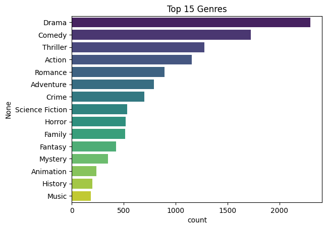
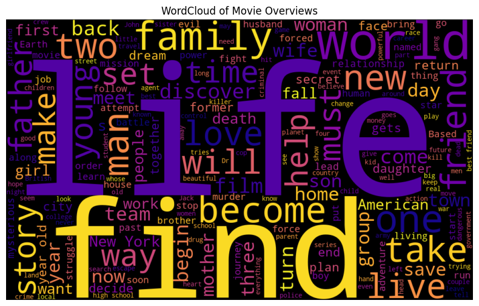
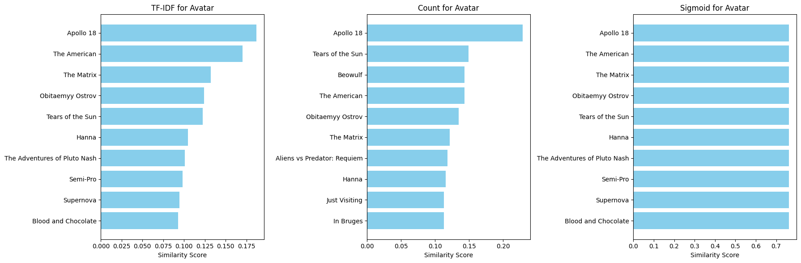
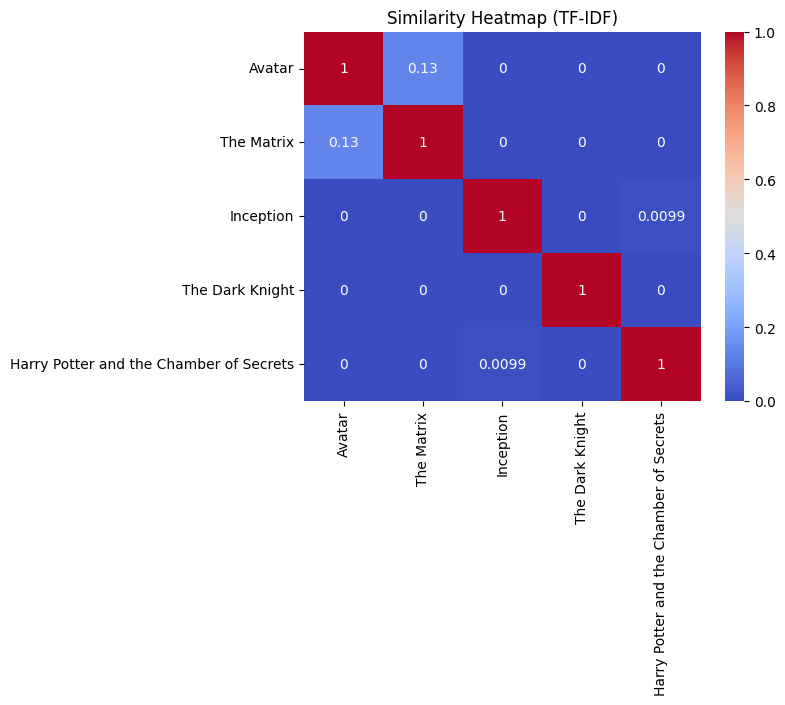
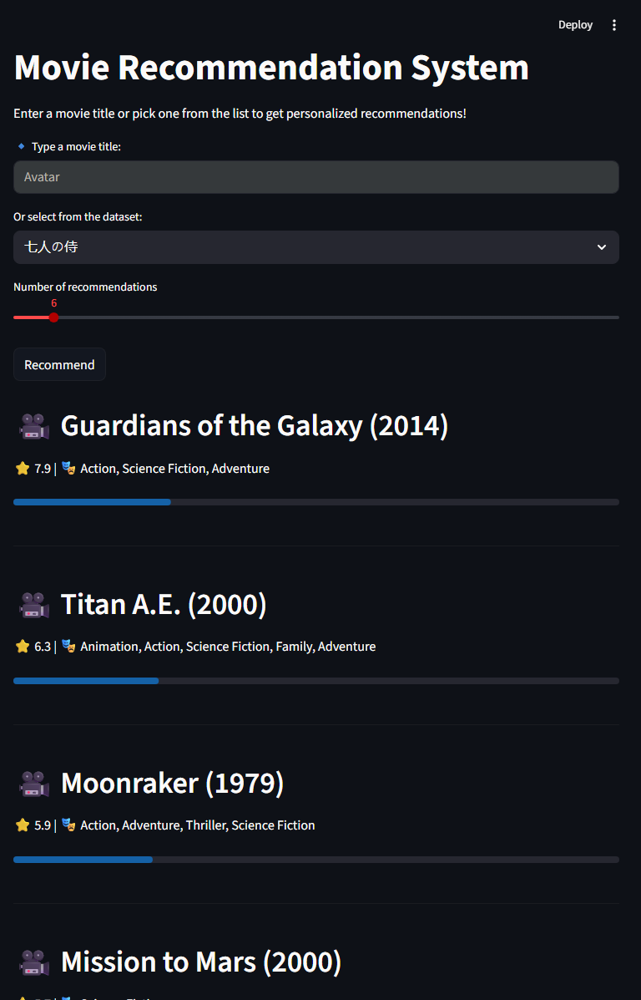

#  Movie Recommendation System  

A **content-based movie recommendation system** powered by **Natural Language Processing (NLP)** and **similarity measures**, built with **Python**, deployed via **Streamlit**, and containerized with **Docker**.  

The project is based on the **TMDB 5000 Movies + Credits dataset**, covering the full pipeline from preprocessing to delivering an interactive interface for personalized recommendations.  

---

## 📌 Features  

-  **Preprocessing pipeline**: cleaning and merging the movies and credits datasets.  
-  **Feature Engineering**: creation of the `soup` column (combination of keywords, genres, cast, and crew).  
-  **Recommendation models**:  
  - **TF-IDF Vectorizer** + Cosine Similarity  
  - **CountVectorizer** + Cosine Similarity  
-  **Exploratory Data Analysis (EDA)**:  
  - Genre distribution  
  - Keyword wordclouds  
  - Dataset descriptive statistics  
-  **Streamlit interface**: select movies via manual input or dropdown from the dataset.  
-  **Dockerized deployment**: run the system easily and consistently in any environment.  

---

## ⚙️ Project Structure  

```bash
Movie-Recommendation/
│── data/
│   ├── raw/                 # Original data (movies + credits)
│   └── processed/           # Cleaned data
│── notebooks/
│   └── analysis.ipynb       # Exploratory notebook
│── app.py                   # Streamlit application
│── requirements.txt         # Dependencies
│── Dockerfile               # Container configuration
│── README.md                # Documentation


##  Exploratory Data Analysis

🎭 Top 15 Most Frequent Genres

I analyzed the distribution of genres across the dataset. The most common genres are Action, Adventure, Drama, and Comedy.



☁️ WordCloud of Keywords

I generated a wordcloud of movie keywords to visualize the most relevant concepts driving movie metadata. Larger words indicate higher frequency.



🤖 Recommendation Example

For the movie Avatar, I compared recommendations using TF-IDF, CountVectorizer, and Sigmoid Kernel.



🔥 Similarity Heatmap (TF-IDF)

To illustrate how the recommendation engine works internally, we generated a similarity matrix using TF-IDF + Cosine Similarity.
The heatmap below shows how close the content of some selected movies is:
💡 Example: Avatar and The Matrix share a degree of similarity due to overlapping sci-fi and action elements.



🖥️ Streamlit App

The final interactive app allows the user to select or type a movie and receive personalized recommendations.
Example output format:

